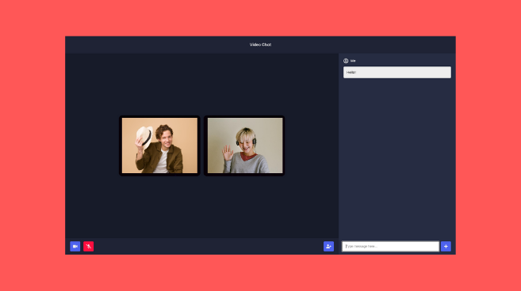

# Video Chat Platform

A simple real-time video chat platform built with Node.js, Express, Socket.IO, PeerJS, and WebRTC.

Users can open the app, get a unique room link, invite others, join the same meeting room, and chat while sharing live audio and video.



## Features

- Unique room generation using UUIDs
- Real-time peer-to-peer video calling with WebRTC
- Live room chat for all participants
- Participant count shown inside the meeting UI
- Mute and camera toggle controls
- Invite button for quickly sharing the room link
- Responsive meeting layout with a dedicated chat panel

## Tech Stack

- Node.js
- Express
- Socket.IO
- PeerJS
- WebRTC
- EJS
- HTML, CSS, JavaScript

## Project Structure

```text
.
|-- public/
|   |-- script.js
|   `-- style.css
|-- views/
|   `-- room.ejs
|-- server.js
|-- package.json
`-- README.md
```

## Getting Started

### 1. Clone the repository

```bash
git clone https://github.com/Arpit-dev467/video-chat-platform.git
cd video-chat-platform
```

### 2. Install dependencies

```bash
npm install
```

### 3. Start the server

```bash
npm start
```

### 4. Open the app

Visit:

```text
http://127.0.0.1:3030/
```

If port `3030` is already in use, start the app with a different port:

```bash
$env:PORT=4000
npm start
```

Then open `http://127.0.0.1:4000/`.

## How It Works

- Visiting `/` creates a new meeting room and redirects you to a unique URL.
- When users join the same room, Socket.IO notifies participants in real time.
- PeerJS and WebRTC handle direct media connections between users.
- Messages sent in the chat panel are broadcast to everyone in the room.

## Notes

- Camera and microphone permission are required to join a meeting.
- This project currently uses a basic prompt to collect the user's name before joining.
- The app is best suited for learning, demos, and small real-time communication projects.

## Future Improvements

- User authentication
- Better room management
- Screen sharing
- Leave/rejoin flow
- Improved mobile experience
- Production deployment configuration
